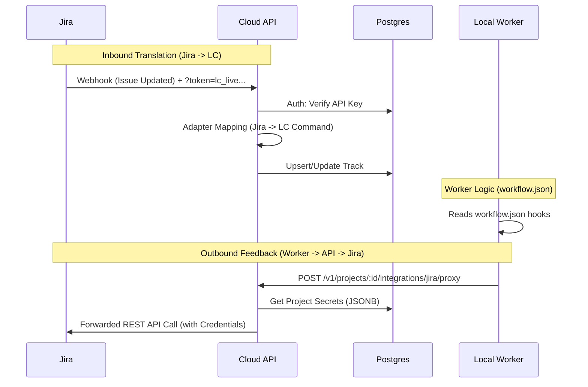

# Plan: Track 1067 - Unified Integration Architecture

Refactor LaneConductor for modular integrations using existing API auth and a new `integrations` JSONB column.

## Call Pattern Schematic

## Phase 1: Core Services & Infrastructure
- [ ] Run migration: `ALTER TABLE projects ADD COLUMN integrations JSONB DEFAULT '{}';`
- [ ] Implement `src/services/TrackService.js` (Centralized Transition Logic).
- [ ] Implement `src/services/HookEngine.js` (Outbound Side-Effects Engine).

## Phase 2: Inbound Webhook Plugin System
- [ ] Implement `src/adapters/index.js` (Adapter Registry).
- [ ] Implement `src/adapters/jira.js` (Payload -> Command Mapping).
- [ ] Refactor `index.js` to use `TrackService` and the `/v1/webhooks/:format` route.

## Phase 3: Integration Proxy API
- [ ] Implement `POST /v1/projects/:id/integrations/:provider/proxy`.
- [ ] Logic: Authenticate Worker -> Resolve `projects.integrations` -> Inject Auth Header -> Forward to Provider.

## Phase 4: Worker Hook Driver & Verification
- [ ] Update Worker to parse `hooks` in `workflow.json`.
- [ ] Implement a "Hook Runner" in the worker that calls the API Proxy.
- [ ] Create `test.md` with CURL commands and verification payloads.
- [ ] Verify End-to-End flow: Jira Create -> LC Sync -> Worker Action -> API Proxy -> Jira Update.

## Phase 5: Multi-Target & Secret Vault
- [x] Refactor `lc.mjs` to support arbitrary collectors and fanned-out pushes.
- [x] Add `--store-type` and `--secret-name` to fetch tokens natively.
- [x] Add CLI commands `add-target` and `remove-target` for API target lifecycle management.
- [x] Refactor `remote-sync` to broadcast bidirectional track states to all collectors.

## Verification Plan
1. Use `test.md` to simulate Jira webhooks.
2. Verify track appears in UI and local `.laneconductor` folders.
3. Move track between lanes and verify outbound side-effects (logs or mock responses).
4. Verify `add-target --store-type gcp-secret` successfully resolves credentials.
5. Verify `remove-target <url>` successfully cleans up `.laneconductor.json` and reorganizes `.env` tokens.
